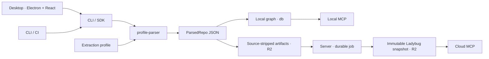

# Coredoc Architecture

Last checked against source: 2026-09-22

Coredoc extracts a code graph from repositories, makes it queryable by agents,
and lets teams share it. Desktop is the primary product surface; CLI/SDK and CI
reuse the parsing and publication workflows. The diagram below covers local and
hosted-cloud flows; customer on-prem deployments use Neo4j as their primary graph database.

## System Overview

## Package ownership

| Area | Owns | Starting points |
| --- | --- | --- |
| `packages/core` | Shared output/config/intent contracts, IDs, cross-repo linking, utilities | `src/types/output.ts`, `src/id-generator.ts`, `src/cross-repo/` |
| `packages/profile-parser` | Language providers, syntax/semantic facts, shared profile engine, scoring, parser runtime | `src/providers/index.ts`, `src/substrate/engine.ts`, `src/types/profile.ts` |
| `packages/cli` | Commands and workflow orchestration used by local, desktop, and CI callers | `src/index.ts`, `src/sdk/`, `src/ci/`, `src/parser-loader.ts` |
| `packages/db` | Backend selection, graph repository contract, file snapshots, source stripping | `src/backend-factory.ts`, `src/types.ts`, `src/strip-source.ts` |
| `packages/mcp` | Local MCP server and shared graph tools | `src/server.ts`, `src/tools/` |
| `apps/desktop` | Electron main/preload, React UI, local and cloud workspace experience | `src/main/`, `src/preload/`, `src/renderer/` |
| `apps/web` | Cloud web UI: React SPA built separately and served by `apps/server` | `src/features/`, `src/routes/` |
| `apps/server` | NestJS API, WorkOS auth, workspace control plane, publication jobs, cloud MCP and intent | `src/modules/`, `src/auth/`, `prisma/` |

Cross-package imports use established `@coredoc/<package>` exports. Follow the
nearest implementation before adding a new layer. Tree-sitter/SCIP runtime belongs
to `profile-parser`, not the shared `core` package. Database-specific graph access
belongs behind `@coredoc/db`; cloud lifecycle orchestration belongs in the server.

## Extraction: profile, engine, substrate

A declarative `profile.ts` describes framework/repository conventions. It is authored
with the `author-profile` skill, reviewed/scored, then loaded by the CLI or SDK.
There is no `coredoc generate` command.

- **Profiles** describe route/decorator/ORM/DI/external-client conventions as data.
- **The shared engine** interprets those rules over substrate facts and emits
  `ParsedRepo`. It should not gain a parallel pipeline for each language.
- **Language providers and substrates** own language syntax, toolchain integration,
  and semantic indexing. Tree-sitter supplies syntax; SCIP adds semantic information
  where supported and available. Language-specific code belongs here, not in a
  declarative framework profile or generic database schema.

Registered providers are wired in
[`providers/index.ts`](packages/profile-parser/src/providers/index.ts): TS/JS,
Ruby, Swift, Python, Rust, Go, Zig, Kotlin, and C#. That registry is authoritative;
registration does not imply identical extraction coverage across languages.
Start language work from an existing provider and
[ADDING-A-LANGUAGE.md](docs/ADDING-A-LANGUAGE.md); new framework rules use
[ADDING-A-FRAMEWORK.md](docs/ADDING-A-FRAMEWORK.md).

`MultiTargetProfile` composes language scopes into one repository result. Its targets
are resolved through the provider registry, parsed, and merged into one `ParsedRepo`.
Keep same-language workspace packages together so semantic resolution can see their
shared index. See `src/types/multi-profile.ts`, `src/providers/resolve.ts`, and
`src/multi/` in `profile-parser` for validation, ownership, merging, and scoring.

Parsing runs on trusted repositories. Enhanced analysis may execute build code and
use network access; it is not an untrusted-code execution service. Tool prerequisites,
basic/enhanced behavior, and explicit fallback policy are documented in the
[parser README](packages/profile-parser/README.md). Follow existing provider patterns
instead of independently inventing tool installation, isolation, or caching layers.

## Data flow

1. Desktop or CLI loads project/repository configuration and the extraction profile.
2. The language provider supplies facts; the profile engine emits parsed JSON under
   the configured output directory (normally `coredoc-output/`).
3. Optional summarization and embeddings enrich the output. These may call external
   providers; local graph storage does not mean every authoring/enrichment step is offline.
4. Local push transforms available parsed artifacts into a Ladybug project snapshot;
   unparsed repositories are omitted. Cross-repo linking runs through the shared linker.
5. Cloud publication strips source, uploads versioned artifacts, and requests a
   durable server job. The worker builds/publishes a workspace graph snapshot for
   cloud readers.

`coredoc parse -r <repo> --project <id>` is the parse entry point. The CLI currently
has no `--incremental` parse flag; do not confuse index reuse, graph publication,
and parser execution as one incremental mode.

## Storage and cloud publication

| Surface | Current backend |
| --- | --- |
| Local graph | Ladybug project snapshots; desktop selects it at startup |
| Local operations/metrics | SQLite; separate from the graph |
| Customer on-prem graph | Neo4j is the primary graph database |
| Cloud control plane | Prisma/PostgreSQL: workspaces, members, jobs, artifact/snapshot metadata, intent |
| Cloud graph data plane | Immutable Ladybug snapshot files on R2 (`graphBackend=file_snapshot`) |

The Turso service is decommissioned. New workspace rows and missing-value runtime
fallbacks default to `file_snapshot`. The default migration did not rewrite existing
rows, and server routing still recognizes the historical `turso` value. That mutable
path also serves on-prem Neo4j through `WorkspaceDbPoolService` when
`COREDOC_DB_BACKEND=neo4j`; do not remove it based on the old label alone.

`packages/db/src/backend-factory.ts` owns local backend selection and project file
binding. Some standalone CLI/factory defaults still say `sqlite`; this is legacy
implementation drift, not the current graph architecture. Select
`COREDOC_DB_BACKEND=ladybug` explicitly in standalone development commands.
Project isolation matters: repository keys are unique within a graph, not
across every project. Do not merge unrelated project graphs by dropping that boundary.

For a cloud push, [`PushController`](apps/server/src/modules/push/push.controller.ts)
accepts artifact versions and normally returns a queued job. `?sync=true` waits for
the durable job on `file_snapshot`; it does not bypass the worker. The
[`JobProcessor`](apps/server/src/modules/jobs/job-processor.service.ts) dispatches
current snapshot work to
[`GraphSnapshotExecutionService`](apps/server/src/modules/graph-snapshot/graph-snapshot-execution.service.ts).
It assembles the repository manifest, materializes the immutable graph, and publishes
its control-plane reference. This describes the hosted-cloud snapshot path;
customer on-prem graph storage uses Neo4j.

## Shared output and identity

[`ParsedRepo` / `OutputFormat`](packages/core/src/types/output.ts) is the contract
between extraction, summarization, graph storage, and consumers. Keep the complete
schema there rather than maintaining partial copies in root docs. It includes code
nodes, entrypoints, entities, calls/imports/DB operations/external calls, and optional
frontend/SDK information. Functions and methods share `functions[]`; class method
references use their IDs.

[`StableIdGenerator`](packages/core/src/id-generator.ts) is the single ID authority:

- Stable node IDs follow `{repoHash}:{type}:{path}:{name}`, with kind-specific forms
  for files, entrypoints, and edges.
- Versioned IDs add the content checksum: `{stableId}@{checksum}`.
- `repoHash` derives from the canonical repository key; callers must not substitute
  a machine-specific path. Formula/input changes require a migration or approved cutover.

The workspace linker in `packages/core/src/cross-repo/` resolves external calls to
entrypoints and SDK symbols. An optional project `mapper.json` supplies overrides
within that same pass. See [the mapper guide](README.md#cross-service-mapper);
do not add a second resolution engine alongside it.

## MCP and product intent

Graph tools expose discovery, explanation, impact, and cross-repo navigation. Exact
names and schemas live in `packages/mcp/src/server.ts` and the shared tool definitions;
cloud wrappers add workspace authority. `run_cypher_query` is backend-gated,
`semantic_search` is optional/local, and tool sets depend on the connected surface.

Product intent complements the code graph. Local projects can use the
`.coredoc/intent.json` overlay via intent CLI/MCP reads. Cloud-owned intent is served
by workspace intent tools; after cutover the local overlay is a frozen snapshot.
Read accepted decisions/non-goals from the active authority. Code anchors locate
implementation touchpoints; they do not prove runtime conformance.

## Distribution and CI

Desktop is the primary distribution. `action.yml` runs the CLI headlessly: the
default channel downloads a CLI bundle and runtime sidecar; an explicit `image`
input selects Docker. CI can use a checked-in profile or fetch the workspace profile,
parse, optionally summarize, and publish. The caller chooses the branch/trigger;
there is no universal “merge to master” requirement. See [CI setup](ci/README.md).

The `coredoc-workflows` plugin is external OSS. This repo owns `plugins/coredoc`
and only the pinned capture-contract subset in `vendor/coredoc-workflows-runtime/`.
