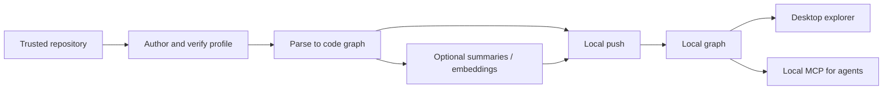
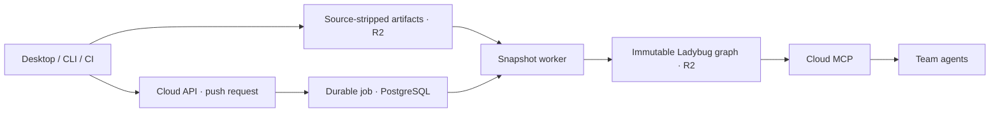

# Coredoc — How It Works

Coredoc turns repositories into a code graph that developers and AI agents can
query. The desktop app is the main entry point; CLI and CI cover automated workflows.
A declarative extraction profile describes a repository's conventions, and language
substrates provide syntax and optional semantic facts to the shared parser engine.

## Local workflow

Add a repository, author/review its `profile.ts`, parse it, and publish the result
to the local graph. The profile is data rather than a generated bespoke parser.
Verification uses the provider's scoring and output checks; extraction coverage
varies by language and available tools.

The local code graph uses Ladybug. SQLite stores local operations and metrics,
not the current product graph. Local graph querying needs no cloud workspace. AI profile
authoring, configured summary/embedding providers, and tool downloads can need
network access; “local-first” does not mean every operation is offline.

**Use parsing and enhanced indexing only on trusted repositories and branches.**
Language toolchains may execute repository build code. Basic/enhanced modes,
prerequisites, and supported fallbacks are in the
[parser README](packages/profile-parser/README.md).

## Agent workflow

An agent uses MCP tools to find symbols, inspect entrypoints, trace callers and
dependencies, and assess impact. It then reads relevant source for exact behavior.
The graph reflects the last parse; freshness and extraction gaps matter.

Product intent supplies reviewed requirements and non-goals that code cannot state.
Use workspace intent tools for cloud-owned intent, or local intent tools for a local
project. An implementation anchor is a location, not proof that a requirement works.

## Team and cloud workflow

A linked cloud workspace shares the graph with its members. PostgreSQL holds the
control plane, including workspace state and jobs. R2 holds parsed artifacts and
immutable Ladybug graph snapshots. The server publishes a completed snapshot for
readers. Customer **on-prem deployments use Neo4j as their primary graph database**.
**The Turso service is decommissioned.** Historical backend labels remain in code;
the mutable server path also supports on-prem Neo4j.

Push normally returns a job ID so clients can follow progress. On the current
snapshot backend, a synchronous request waits for the same durable worker path.
See [architecture](ARCHITECTURE.md#storage-and-cloud-publication) for the code owners.

## CI updates

Configure a workflow for the repository's chosen production branch or a manual run.
The Coredoc GitHub Action uses a downloaded CLI bundle by default, or a Docker image
when selected. It loads a checked-in or workspace profile, parses, optionally
summarizes, uploads artifacts, and waits for publication. Desktop also provides
GitHub/GitLab setup templates; toolchain prerequisites still belong to the runner.

See [README](README.md) for commands, [CI setup](ci/README.md) for runner details,
and [ARCHITECTURE.md](ARCHITECTURE.md) for package boundaries and current data flow.
