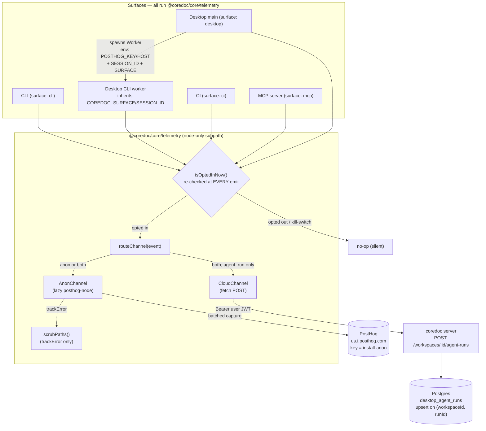

# Observability & Telemetry

Canonical feature doc for coredoc's telemetry/observability system. Audience: engineers
onboarding or operating the product, **and** AI agents reading this repo to understand how
instrumentation works. It describes the **shipped** code (landed on `main`) — trust it over
prior assumptions.

Source of truth for the client lives in `packages/core/src/telemetry/`. Every surface
(CLI, desktop, CI, MCP) and the cloud spine (`apps/server`) plug into it.

---

## 1. Overview

Coredoc is a local-first tool that graduates to a cloud workspace and then to CI-driven
auto-sync. Telemetry exists to answer three product questions with real data instead of
guesses:

1. **Product funnel** — do installs actually convert?
   `repo_added → profile_authored → parse_completed → push_completed → mcp_first_answer`,
   correlated on `(install_id, repo_id)`, broken down by `surface`.
2. **Parse health** — is the profile-driven engine producing a usable graph, or silently
   degrading? The `parse_completed` **scorecard** plus `parse_anomaly` rules catch the
   class of failure where the engine can't find the tree-sitter WASM binaries and emits
   0 calls / high errors (the field-observed desktop-worker bug).
3. **Agent-run economics** — what does an `author-profile` agent run cost (tokens, USD,
   turns, tool calls, human interventions)? Emitted anonymously as coarse buckets and,
   for cloud workspaces, attributed in full to the workspace.

### The load-bearing decision: instrument the shared substrate once, tag the surface

Every surface — the standalone CLI, the desktop app's spawned worker, CI, and the MCP
server — runs the **same** `@coredoc/core/telemetry` client. Rather than re-instrument
each surface, we instrument the operations they all share (`parse`, `summarize`, `push`,
`resolve`) **once** at the CLI/SDK substrate, and each surface just calls
`initTelemetry({ surface })` to tag its rows. A desktop parse and a CLI parse emit the
**identical** `parse_completed` event; only the `surface` prop differs. This is why
`operations-tracker.ts` is the single attach point for five call sites, and why the
desktop worker inherits `COREDOC_SURFACE=desktop` from its parent rather than having its
own telemetry code.

Guiding invariants, enforced throughout: **opt-in, default OFF**; **never leak a path,
repo name, or source**; **node-only** (the client must never poison the web bundle);
**closed enums** for every event name / error code; **additive-only** cloud migrations;
**bounded** flush so telemetry can never hang a command.

---

## 2. Architecture

### The shared node-only client — `@coredoc/core/telemetry`

A single package subpath, no deep imports:

```jsonc
// packages/core/package.json
"./telemetry": { "types": "./dist/telemetry/index.d.ts", "import": "./dist/telemetry/index.js" }
```

`posthog-node` is a runtime dependency, but it is **never** imported at module top level —
it is loaded lazily via `await import('posthog-node')` inside `AnonChannel.getClient()`.
This is load-bearing: `apps/web` value-imports `@coredoc/core`, so a top-level
`posthog-node` import would drag a node-only library into the browser bundle. The
`./telemetry` subpath is the containment boundary — only node surfaces import it, and the
desktop **renderer** never does (it keeps its own `posthog-js` for pageviews and reaches
main only via `window.electronAPI` IPC).

### Two channels

| Channel | Class | Transport | Identity | Carries |
|---|---|---|---|---|
| **Anon** | `AnonChannel` | PostHog (`posthog-node`) | `install_id` (per-install UUID, non-joinable `repo_id`) | All events; coarse/bucketed |
| **Cloud** | `CloudChannel` | `POST /api/v1/workspaces/:id/agent-runs` on the coredoc server | `workspaceId` + signed-in desktop user JWT | `agent_run` **only**, full summary |

The two channels **do not join** by design: anon keys on `install_id`, cloud keys on
`workspaceId`; the per-install HMAC `repo_id` is deliberately non-joinable across installs.

### Routing table

`routeChannel(event)` decides the destination. In P0, only agent runs are dual-channel:

| Event | `routeChannel` result | Where it lands |
|---|---|---|
| `agent_run` | `'both'` | Anon (bucketed) **and** cloud (full, when a workspace is bound) |
| *everything else* (incl. `push_*`) | `'anon'` | PostHog only |

`emitAgentRun` is the only dual-emit path. `track` / `trackError` are anon-only.

### Surfaces and how each emits

| Surface | `surface` tag | Init site | How it emits |
|---|---|---|---|
| **CLI** | `'cli'` | `packages/cli/src/index.ts` top-level `initTelemetry` | `trackOperation` wraps parse/summarize/push; funnel hooks via Commander `preAction`/`postAction` |
| **Desktop** | `'desktop'` | `apps/desktop/src/main/telemetry-manager.ts` `initMainTelemetry()` | Main-process crash hooks + agent-run economics; spawned CLI **worker** inherits env and emits parse/summarize/push itself |
| **CI** | `'ci'` | `packages/cli/src/ci/run.ts` `runCi()` | Re-stamps surface; rides the same CLI operation attach points |
| **MCP** | `'mcp'` | `packages/mcp/src/server.ts` `startServer` | `mcp_first_answer`, per-call `mcp_queries` rows, next-start `mcp_session_summary` rollup |

### Data-flow diagram



---

## 3. The client API

All exports come from `packages/core/src/telemetry/index.ts`.

### Exported functions

| Signature | When to call it |
|---|---|
| `initTelemetry(ctx: InitContext = {}): void` | Once per process, early. Records pending context (surface, sessionId, channels) only — **channels are built lazily on first emit**, so this never touches the network. Idempotent; a later auto-init on first `track` is harmless. |
| `track(event: EventName, props?: Props): void` | Fire-and-forget anon event. The normal path for funnel/parse/summarize/push events. |
| `trackError(err: unknown, code: ErrorCode, props?: Props): void` | Anon error capture. **Scrubs** the message (sliced to 200 chars) and stack via `scrubPaths`, then routes through PostHog `captureException`. The *only* place scrubbing happens. |
| `withTiming<T>(step: StepName, fn): Promise<{ result: T; durationMs: number }>` | Times an async step and returns the duration explicitly. Emits **nothing** on its own (the `step` arg is currently `void`'d/unused); callers decide what to emit. |
| `emitAgentRun(summary: AgentRunSummary, opts?: { cloud?: CloudChannelConfig }): void` | Emit an agent-run economics event. Dual-emits: anon (bucketed) first, then cloud (full) — ephemeral per-run channel when `opts.cloud` is present. |
| `shutdownTelemetry(deadlineMs = 500): Promise<void>` | Bounded drain + flush of process-global channels. Resolves within the deadline no matter what; never rejects/hangs. |
| `setCloudChannel(config: CloudChannelConfig): void` | Swap the live process-global cloud channel (used when a run's workspace is known up front). Swaps unconditionally, even after a prior emit. |
| `clearCloudChannel(): void` | Reset the global cloud channel to a config-less no-op — prevents cross-workspace mis-attribution after a cloud run followed by a local-only run. |

Test-only seams `__setChannelsForTests` / `__resetTelemetryForTests` are exported but marked
not-public. `scrubPaths`, `AnonChannel`, `CloudChannel` are **not** re-exported (internal).

Re-exported values: `EventName, ErrorCode, StepName, SCHEMA_VERSION` (from `events.ts`),
`detectParseAnomalies` (`parse-anomaly.ts`), `newInvocationId, repoId, resolveSession`
(`ids.ts`). Re-exported types: `Surface, Props, BaseProps, DetectParseAnomaliesInput,
ResolveSessionOptions, CloudChannelConfig`, plus locally-defined `AgentRunSummary` and
`InitContext`.

### The id / session model

Six identifiers travel with events. Each is derived differently:

| Id | Grain | Derivation |
|---|---|---|
| `install_id` | per machine install | UUID minted on first `getTelemetryConfig()` write to `~/.coredoc/telemetry.json`, stable forever. The anon `distinctId`. |
| `session_id` | ~30-min sliding activity window | `resolveSession()` — `opts.envSessionId` (`COREDOC_SESSION_ID`) wins outright; else reuse `~/.coredoc/session.json` if `now - lastActivityAt < 30min`; else mint a fresh v4 UUID. Every call slides `lastActivityAt` forward (mode `0o600`, best-effort). |
| `invocation_id` | per process/command | `newInvocationId()` = `randomUUID()`, fresh each invocation. |
| `repo_id` | per repository, per install | `repoId(installId, repoRoot)` = `HMAC-SHA256(installId, realpath(repoRoot))` sliced to 16 hex chars. Deterministic, **non-joinable** across installs, never throws (falls back to `path.resolve` if realpath fails during onboarding). |
| `run_id` | per agent run | Supplied by the caller in `AgentRunSummary.runId`; the cloud upsert key. |
| `surface` | per process | `'cli' \| 'desktop' \| 'ci' \| 'mcp'`, from `ctx.surface ?? process.env.COREDOC_SURFACE ?? 'cli'`. |

**Session stitching:** a desktop-spawned worker inherits `COREDOC_SESSION_ID`, so
`resolveSession({ envSessionId })` returns the parent's id and the worker's events join the
parent session. The MCP server instead passes an **explicit** `sessionId` into
`initTelemetry` (minted per stdio process) so a parallel `coredoc` command and the server
never collide on the file-backed session.

### `BaseProps` — auto-carried on every event

`buildBaseProps()` stamps these 9 keys onto every emit:

```
install_id, session_id, invocation_id, surface,
repo_id?  (optional — omitted when no repo is in scope),
cli_version, engine_version, platform, schema_version
```

`platform = process.platform`; `cli_version` / `engine_version` come from
`COREDOC_CLI_VERSION` / `COREDOC_ENGINE_VERSION` (or `'unknown'`); `schema_version` is the
const `SCHEMA_VERSION = 1`. Note the client's base `repo_id` is **never populated** — no
caller passes `repoRoot` to `initTelemetry` — so events that need it (`parse_completed`,
`parse_anomaly`, `repo_added`, `mcp_first_answer`) derive and attach their own `repo_id`.

### `AgentRunSummary` and `InitContext`

```ts
// AgentRunSummary — all 10 required
runId: string; kind: string; tokensIn: number; tokensOut: number;
costUsd: number; turns: number; toolCalls: number; outcome: string;
interventions: number; durationMs: number;

// InitContext — all optional
surface?: Surface; sessionId?: string; repoRoot?: string;
channels?: { posthogKey?: string; posthogHost?: string; cloud?: CloudChannelConfig };
```

---

## 4. Event taxonomy

Every `EventName` member, its wire value, where it attaches, its distinctive props, and its
channel. `BaseProps` (§3) ride on all of them and are not repeated here.

| Event (wire value) | Attach point | Key props | Channel |
|---|---|---|---|
| `command_completed` | CLI `postAction` → `trackCommandCompleted` (`index.ts`) | `command`, `duration_ms` | anon |
| `command_failed` | CLI `reportCliError` on unhandled crash | `command`, `duration_ms`, `error_code` (no free-text message) | anon |
| `repo_added` | `sdk/parse.ts` on first-parse detection **only** | `package_count`, `language_hint`, `repo_id` | anon |
| `profile_authored` | CLI `profile score` action → `trackProfileAuthored` | `outcome: 'pass' \| 'fail'` (sole prop) | anon |
| `parse_completed` | `operations-tracker.ts` parse success branch | scorecard (`files, functions, calls, entrypoints, entities, parse_time_ms, error_count, package_count, languages`) + `duration_ms` + `repo_id` | anon |
| `parse_failed` | `operations-tracker.ts` parse catch (then flush-on-fail) | `duration_ms`, `error_code` | anon |
| `parse_anomaly` | `operations-tracker.ts`, one per fired `detectParseAnomalies` rule | `rule_id`, `repo_id` | anon |
| `summarize_completed` | `trackOperation('summarize')` metadata | `totalFunctions, summarized, cached, failed, model, duration_ms` | anon |
| `push_completed` | `push/unified.ts` local push via `trackOperation` | `backend, totalNodes, totalEdges, target:'local', duration_ms` | anon |
| `push_failed` | `operations-tracker.ts` push catch (then flush-on-fail) | `duration_ms`, `error_code` | anon |
| `resolve_completed` | direct attach in `sdk/resolve.ts` `runResolveCore` (not `trackOperation`) | `edges_resolved`, `duration_ms` | anon |
| `mcp_first_answer` | MCP `emitFirstAnswer`, once per repo on first non-empty answer | `repo_id`, `commits_stale?` (omitted when null) | anon |
| `mcp_session_summary` | MCP next-start rollup of a prior session | `tool_calls, distinct_tools, error_count, duration_ms_total, duration_ms_avg` | anon |
| `mcp_feedback` | **defined but nothing emits it locally** — feedback lives cloud-side in Postgres `McpFeedback` (keyed on `workspaceId`/`userId`) | — | (cloud-only, see §6/§11) |
| `agent_run` | `emitAgentRun` (desktop agent-run completion) | anon: `cost_bucket, outcome, turns`; cloud: full `AgentRunSummary` | **both** |

There are **15** `EventName` members. `command_run` / `command_error` from P0 were retired in
favor of `command_completed` / `command_failed` (running both would double-count).

### Vocabularies

- **`ErrorCode`** (`error_code` on `*_failed`; `rule_id` on `parse_anomaly`):
  failure codes `wasm_missing`, `auth_failed`, `network_error`, `parse_error`,
  `push_rejected`, `unknown`; anomaly rule_ids `zero_calls_nonzero_functions`,
  `error_rate_gt_20pct`, and `wasm_missing` (doubles as anomaly hint).
- **`StepName`** (for `withTiming`): `substrate`, `scip`, `extract`, `write`.
- **`cost_bucket`** (anon `agent_run`): `< 0.1 → 'lt_0.1'`, `< 1 → 'lt_1'`, else `'gte_1'`.

---

## 5. Privacy & security model

The core principle: **over-redact, never under-redact; a leak is a bug, over-scrubbing is
acceptable.** Concretely:

- **Opt-in, default OFF.** A fresh `~/.coredoc/telemetry.json` is
  `{ installId, enabled: false, firstSeenAt }`. Nothing emits until the user explicitly
  enables (`coredoc telemetry on`, or the desktop consent card's "Enable" button).
- **Re-evaluated at emit time, not latched.** `isOptedInNow()` runs on **every**
  `track`/`trackError`/`emitAgentRun` (inside `ensureInit().then(...)`), checking
  `config.enabled === true && process.env.COREDOC_TELEMETRY_DISABLED !== '1'`. A mid-session
  Disable on a long-lived surface (desktop main) stops emits immediately without re-init.
  Identity (install/session/invocation/surface) *does* latch in `doInit`; only the gate is
  re-read.
- **Kill switch.** `COREDOC_TELEMETRY_DISABLED=1` forces `enabled: false` inside
  `getTelemetryConfig()` **and** is re-checked in `isOptedInNow()` (belt-and-suspenders
  against a stale cache).
- **`scrubPaths` redaction** (`sanitize.ts`, applied in `trackError` only — message + stack,
  never at call sites). Ordered passes, order matters: (1) git remotes (SSH scp-form and
  HTTPS) → `<repo>` first, so scp remotes aren't half-caught by path patterns;
  (2) Windows drive-letter (`C:\…`) and UNC (`\\server\share\…`) paths → `<path>`;
  (3) home-rooted paths (anchored on `homedir()`, segment-boundary so `/Users/alex2` isn't
  mis-attributed) → `<path>`; (4) general absolute POSIX paths → `<path>`. A trailing
  `:line:col` suffix survives outside the placeholder.
- **Closed enum schemas.** Event names, error codes, and outcomes are enums, not free
  strings. The cloud DTO locks `outcome` to `['success','cancelled','error']` and bounds
  `kind` to 64 chars. `coredoc telemetry show` is built from `Record<EventName, string>` so
  the build fails until a new event is disclosed.
- **`repo_id` non-joinable HMAC.** `HMAC-SHA256(installId, realpath)` — stable within an
  install, uncorrelatable across installs.
- **Node-only bundle constraint.** `posthog-node` is lazy-imported so the client can be
  value-imported by `@coredoc/core` consumers (incl. `apps/web`) without poisoning the web
  bundle. The renderer never imports `@coredoc/core/telemetry`.
- **First-run consent, never auto-enable.** Desktop shows a consent **card**; CLI prints a
  one-time **stderr notice**. Both stamp `consentPromptedAt` but neither flips `enabled` —
  showing the prompt is not consent.
- **Error-message truncation.** `trackError` slices the message to 200 chars before scrub.
  Crash-path funnel events (`command_failed`) carry **no free-text message at all**, because
  crash strings can embed un-redactable repo/workspace/branch names.
- **"What is NEVER sent"** (from `coredoc telemetry show`): source code / file contents /
  diffs; file paths / function names / repo names; git commit messages / env vars; any PII.

---

## 6. Per-surface behavior

### CLI (`packages/cli`)

- **Bundled-key codegen.** `scripts/gen-build-env.mjs` runs as the **first step of the CLI
  build** and overwrites `src/build-env.ts` with the literal, trimmed values of
  `COREDOC_POSTHOG_KEY` / `COREDOC_POSTHOG_HOST` from the environment (the CLI build is pure
  `tsc`, no bundler `define`). Committed defaults are **empty**, so an unrun/dev build
  resolves to a no-op channel, and a local build with unset env rewrites the same empty
  values byte-for-byte (no git churn). `index.ts` passes these as
  `initTelemetry({ surface, channels: { posthogKey, posthogHost } })` at module top level —
  **without this the standalone CLI has no key and every emit is a silent no-op.** Runtime
  `COREDOC_POSTHOG_*` still wins over the bundled value.
- **Operation attach.** `operations-tracker.ts` `trackOperation` is the single attach point
  for parse (×2), summarize (×2), push (×1). Telemetry is **ungated by DB availability** —
  a SQLite failure still emits. Success emits the completed event; failure emits the
  `*_failed` event (parse/push only — summarize has no failed event) then
  `await shutdownTelemetry(500)` (flush-on-fail) because the CLI's ~43 `process.exit(1)`
  sites bypass `beforeExit`.
- **Funnel.** Commander `preAction`/`postAction` hooks emit `command_completed`; the crash
  handler `reportCliError` emits `command_failed`. Telemetry subcommands are skipped
  (`isTelemetryCommandPath`).
- **`coredoc telemetry show`.** `buildTelemetryShowText` enumerates **every** `EventName`
  via `Object.values(EventName)` with `EVENT_DESCRIPTIONS: Record<EventName, string>`
  (typed → build fails until a new event is disclosed), lists the real `BaseProps` (no
  stale `$lib`/`distinctId`), and closes with the "never sent" block.
- **First-run notice** (`first-run-notice.ts`). At the top of `main()`,
  `maybeShowFirstRunTelemetryNotice` prints the notice to **stderr** once (guarded by
  `consentPromptedAt`), marks prompted, and returns. Non-interactive by design (no prompt
  to answer — CI / `--yes` / non-TTY behave identically, telemetry stays OFF). Skips
  `telemetry` subcommands. Fully best-effort; a failed read/write never changes command
  semantics.

### Desktop (`apps/desktop/src/main`)

- **Main init.** `index.ts` calls `initMainTelemetry()` at module top level, synchronously,
  **before** the `uncaughtException`/`unhandledRejection` hooks and `app.whenReady()`, so
  crash hooks always have a live client. It mints `mainSessionId = newInvocationId()`, sets
  `process.env.COREDOC_SESSION_ID` + `COREDOC_SURFACE='desktop'`, then
  `initTelemetry(buildMainInitContext())` with anon key/host from `resolvePosthogConfig()`
  (runtime env wins over `BUNDLED_*`; `null` if neither yields both). Cloud attribution is
  deliberately **not** in the launch context — it's resolved per agent-run.
- **Crash scrub.** Both crash hooks route to `captureMainException` →
  `trackError(error, ErrorCode.Unknown, { source, $lib: 'coredoc-desktop-main' })`. This
  fixed a live leak where a raw `captureException` shipped paths; `trackError` gates on
  opt-in and scrubs message + stack **centrally in the core client**, never in the desktop
  adapter. `shutdownMainTelemetry` is wired to `before-quit`.
- **Worker flush.** The spawned CLI worker (`command-runner.ts` `runSdkCommand`) gets an env
  block `{ ...process.env, COREDOC_POSTHOG_KEY: runtime||BUNDLED, COREDOC_POSTHOG_HOST: … }`
  — the bundled key lives only in the main bundle's `build-env` constant, never on
  `process.env`, so it **must** be injected explicitly or the worker emits silent no-ops.
  Inside the worker, `sdk-worker-core.ts` `handleCommandMessage` does
  `await routeCommand(msg)` → `await shutdownTelemetry(500)` → **then** posts the `result`
  message, because the parent hard-kills the worker within ms of `result` and posthog-node
  batches (flushAt=20 / flushInterval=10s) — without this every desktop success event is
  systematically dropped. The failure path does not re-flush here (already flushed in
  `trackOperation`'s catch).
- **Agent-run economics** (`agent-run/*`). `claude-adapter.ts` folds the SDK `result`
  message into a `Done` event: `costUsd = total_cost_usd`, `turns = num_turns`,
  `tokensIn/out = usage.input/output_tokens`, `durationMs = duration_ms`,
  `toolCalls = runState.toolCalls` (per-run counter incremented on every `tool_use` block,
  incl. TodoWrite), `ok = subtype === 'success'`. **Interventions** come from Question
  events, not the SDK: `agent-run-service.ts` increments `session.interventions` each time
  `io.askQuestion` is invoked (one per AskUserQuestion round-trip). `fold()` folds `Done`
  into `session.economics`; a thrown adapter with no `Done` leaves economics zeroed, so
  failures are still counted.
- **Per-run cloud attribution.** The workspace is resolved at **run start**
  (`command-runner.ts` `runGenerateCommand`:
  `cloud = getCurrentConfig()?.projects.find(p => p.id === projectId)?.cloud`;
  `cloudTelemetry = cloud?.enabled && cloud.workspaceId ? buildCloudChannelConfig(...) :
  undefined`) and **bound to that run**, so a concurrent agent-run can't redirect this run's
  summary to its own workspace. At completion `emitAgentRun(summary, { cloud: session.cloud })`
  uses an **ephemeral per-run** `CloudChannel` (emit + `flush(500)`), invisible to
  `shutdownTelemetry`. `buildCloudChannelConfig` obtains the signed-in desktop user's current
  OAuth access token via `getValidTokens()`; missing or failed auth resolves `null` → silent
  drop. It never mints or reads the workspace OTLP token. No workspace → anon-only.
- **Consent card** (`renderer/*`). `TelemetryConsentCard` reads
  `window.electronAPI.getTelemetryStatus()` on mount and opens **only** if
  `!status.consentPrompted`. Two buttons: "Enable telemetry" → `applyTelemetryConsent('enable')`
  (calls `setTelemetryEnabled(true)` **then** `markConsentPrompted`, returns `true`);
  "Not now" / Esc / overlay → `'dismiss'` (marks prompted only, stays OFF). Only a `true`
  return triggers the renderer's own `posthog-js` init. All IPC via `window.electronAPI`;
  the renderer **never** imports `@coredoc/core/telemetry`.

### MCP (`packages/mcp`)

- **Surface init.** `startServer` mints `mcpSessionId = newInvocationId()` **first**, then
  `initTelemetry({ surface: 'mcp', sessionId: mcpSessionId, channels: { posthogKey: BUNDLED_*, … } })`.
  The explicit `sessionId` wins over `resolveSession()`, so the MCP process never reads the
  shared CLI session file (prevents collision with a parallel `coredoc` command). Bundled key
  so a standalone MCP install isn't dark; runtime env still wins. Clean-exit drain via
  `process.once('beforeExit', () => void shutdownTelemetry())` (SIGKILL skips it —
  accepted gap).
- **`mcp_first_answer`.** Module-level `firstAnswerRepos: Set<string>` dedupes across the
  whole stdio session. Fires the **first non-empty** answer per repo (`resultCount !== 0`;
  a `null` count is a single-entity hit and counts). Keyed on `scope.currentPath`; the Set
  guard is synchronous so concurrent calls can't double-emit. Carries `repo_id` and, when
  resolvable, `commits_stale`. Off the hot path, fire-and-forget, never throws into a tool
  call.
- **`commits_stale`** (`commits-stale.ts`). `git rev-list --count <parsedCommit>..HEAD` via
  `execFile` (5 s timeout); non-fatal by construction (missing dir/commit, non-git dir, git
  unavailable → `null`). Rides on `mcp_first_answer` (repo known there → correct grain), not
  the session summary. Attached only when non-null (omitted rather than a misleading 0).
- **`mcp_session_summary`.** Durable **next-start** rollup (at-close is lossy). On start,
  `rollupUnsummarizedSessions(mcpSessionId)` excludes the just-minted current session.
  Mark-before-emit is atomic: `claimUnsummarizedSessionRollups` runs the aggregate SELECT and
  `UPDATE … SET summarized = 1` inside one `BEGIN IMMEDIATE` transaction, so two processes on
  the shared local `coredoc.db` never double-emit. Emits `tool_calls`, `distinct_tools`,
  `error_count`, `duration_ms_total`, `duration_ms_avg` per prior session. Gated by
  `summarized = 0 AND session_id IS NOT NULL AND session_id IS NOT ?` plus a liveness
  `HAVING MAX(queried_at) <= idleCutoff` (`SESSION_IDLE_GRACE_SEC = 1800`). **No
  `commits_stale`** here (a session can span repos).
- **Session-key schema** (`packages/db/src/sqlite/driver.ts`, `mcp-metrics-repository.ts`).
  Per call, `recordQuery` inserts into `mcp_queries (id, tool_name, duration_ms, success,
  scope, result_count, session_id)` (`session_id` = the process `mcpSessionId`;
  `result_count` null for single-entity / 0 empty / N). New columns `session_id TEXT` and
  `summarized INTEGER NOT NULL DEFAULT 0` exist both in the fresh-DB `CREATE TABLE` and as
  PRAGMA-guarded `ALTER TABLE` migrations for pre-existing DBs — applied idempotently the
  first time any CLI/MCP command opens the DB.

### CI (`packages/cli/src/ci`)

`runCi()` calls `initTelemetry({ surface: 'ci', channels: { posthogKey: BUNDLED_*, … } })`.
It reaches this through the Commander entry (whose init already ran), so re-init before any
`track` just re-stamps `surface: 'ci'`. Same lazy/idempotent + runtime-env-wins semantics;
it rides the shared operation attach points.

---

## 7. The cloud spine

The attributed channel targets a dedicated agent-runs module in the NestJS server
(`apps/server/src/modules/agent-runs/`). Global prefix `/api/v1`.

### Endpoints — `agent-runs.controller.ts`

`@Controller('workspaces/:workspaceId/agent-runs')`, class guards
`AuthGuard, WorkspaceRoleGuard, PermissionsGuard`.

| Method | Route | Guards / perms | Returns |
|---|---|---|---|
| `POST` | `/api/v1/workspaces/:workspaceId/agent-runs` (`create`) | `@HttpCode(200)`, `@WorkspaceRole('member')`, `@RequirePermission(TelemetryWrite)` | `{}` — calls `agentRuns.record(workspaceId, body, identityOf(req))` |
| `GET` | `/api/v1/workspaces/:workspaceId/agent-runs` (`list`) | `@WorkspaceRole('member')` + method-level `@UseGuards(JwtOnlyGuard)`, **no** `@RequirePermission` | `{ totals, runs }` (last 50, newest-first) |

The GET is JWT-member-only: `JwtOnlyGuard` bars any service-token principal, so a leaked
**write-only** telemetry token can POST runs but cannot read history.

**Identity is server-derived.** `identityOf(req)` returns `{ userId, userEmail }` from the
authenticated principal. The DTO carries no user field, and the global
`ValidationPipe({ whitelist: true })` strips any payload `user.*` — the body cannot spoof
attribution. The service persists `userId ?? null` / `userEmail ?? null`.

### DTO — `CreateAgentRunDto`

| Field | Validation |
|---|---|
| `runId` | `@IsString()` |
| `kind` | `@IsString()` + `@MaxLength(64)` |
| `tokensIn, tokensOut, turns, toolCalls, interventions, durationMs` | `@IsInt()` + `@Min(0)` |
| `costUsd` | `@IsNumber()` + `@Min(0)` |
| `outcome` | `@IsIn(['success','cancelled','error'])` |
| `appVersion?, surface?` | `@IsOptional()` + `@IsString()` |

The desktop client POSTs a whitelisted body (base props stripped):
`runId, kind, tokensIn, tokensOut, costUsd, turns, toolCalls, interventions, outcome,
durationMs, surface`. `appVersion` is deliberately omitted (no populating source).

### Idempotent upsert — `agent-runs.service.ts`

`record()` does `prisma.desktopAgentRun.upsert({ where: { workspaceId_runId: { … } }, … })`
on the `@@unique([workspaceId, runId])` composite key, so a client retry never
double-counts. This is why the `CloudChannel` does **no** retry/queue/batching — the server
is idempotent. `getWorkspaceAgentRuns()` returns one `aggregate` (`_count._all` + `_sum` of
cost/tokens/turns/toolCalls/interventions) plus `findMany` ordered `createdAt: 'desc'`
`take: 50`.

### `DesktopAgentRun` model + migration

`@@map("desktop_agent_runs")`. Columns: `id` (UUID PK `gen_random_uuid()`), `workspaceId`,
`runId`, `kind`, `userId?`, `userEmail?`, `tokensIn/tokensOut` (Int default 0), `costUsd`
(Float default 0), `turns/toolCalls/interventions` (Int default 0), `outcome` (required),
`durationMs` (Int default 0), `appVersion?`, `surface?`, `createdAt` (Timestamptz `now()`);
relation `workspace … onDelete: Cascade`. Indexes `@@unique([workspaceId, runId])` and
`@@index([workspaceId, createdAt])`.

Migration `prisma/migrations/20260718000000_add_desktop_agent_runs/migration.sql` is
**additive-only**: it `CREATE TABLE`s the new table, its two indexes, and one `ALTER TABLE …
ADD CONSTRAINT` FK — the `ALTER` targets the **brand-new** table, so zero pre-existing tables
are altered/dropped. **Documented rollback: `DROP TABLE "desktop_agent_runs";`.** Wired in
`app.module.ts` as `AgentRunsModule` (unconditional, not env-gated).

### Telemetry-token mint reuse — `tokens/telemetry-token.controller.ts`

`@Controller('workspaces/:workspaceId/telemetry-token')`, guards
`AuthGuard, WorkspaceRoleGuard, JwtOnlyGuard`. `POST /api/v1/workspaces/:workspaceId/telemetry-token`
(`mint`, `@WorkspaceRole('member')`): any workspace member mints a token owned by themselves,
scope hard-coded server-side to `[TokenPermission.TelemetryWrite]` (`telemetry:write`).
`JwtOnlyGuard` blocks service-token principals, so a leaked telemetry token cannot mint more
tokens. Returns `{ token: string }`. Desktop calls this endpoint only when enabling the
external Claude Code OTLP exporter: the token is cached under
`~/.coredoc/credentials.json#workspaces[workspaceId]` and copied into the repository's
`.claude/settings.local.json`. Desktop agent-run telemetry uses the user's OAuth token.

---

## 8. Configuration reference

### Environment variables

| Var | Read by | Effect |
|---|---|---|
| `COREDOC_TELEMETRY_DISABLED` | `getTelemetryConfig()` + `isOptedInNow()` | `=1` forces `enabled:false`, hard kill-switch (overrides opt-in) |
| `COREDOC_POSTHOG_KEY` | build-time codegen; runtime channel | Anon key. **Runtime env wins** over bundled; empty/unset → no-op channel |
| `COREDOC_POSTHOG_HOST` | build-time codegen; runtime channel | Ingestion host. Runtime env wins over bundled; default `https://us.i.posthog.com` |
| `COREDOC_SURFACE` | client `doInit` | Surface tag (`cli`/`desktop`/`ci`/`mcp`); desktop sets `=desktop` for spawned children |
| `COREDOC_SESSION_ID` | `resolveSession()` | Session-id passthrough; wins outright — stitches a worker to its parent session |
| `COREDOC_CLI_VERSION` | `buildBaseProps()` | `cli_version` base prop (else `'unknown'`) |
| `COREDOC_ENGINE_VERSION` | `buildBaseProps()` | `engine_version` base prop (else `'unknown'`) |
| `COREDOC_TREESITTER_WASM_DIR` | `tree-sitter-loader.ts` | Unchecked WASM-dir override (used to reproduce `parse_anomaly`, §9) |
| `COREDOC_SERVER_URL` | desktop `getConfiguredServerUrl` / CLI | Cloud API base for the `CloudChannel` POST |
| `COREDOC_WORKSPACE_ID` | remote push / CI | Not telemetry per se; cloud workspace target |
| `COREDOC_TOKEN` | `ci run` | Service token auth (`cdt_…`) |

(Non-telemetry CLI env — `COREDOC_DB_BACKEND`, `COREDOC_LLM_*`, `OLLAMA_BASE_URL`,
`COREDOC_RUNTIME_MODULES` — is documented in the CLI, not here.)

### State files (both mode `0o600`, under `~/.coredoc/`)

| File | Shape | Written by |
|---|---|---|
| `~/.coredoc/telemetry.json` | `{ installId, enabled, firstSeenAt, lastOptInChangeAt?, consentPromptedAt? }` | `telemetry-config.ts` (`setTelemetryEnabled`, `markTelemetryConsentPrompted`) |
| `~/.coredoc/session.json` | `{ sessionId, lastActivityAt }` | `resolveSession()` (30-min sliding window) |
| `~/.coredoc/credentials.json` | Login fields plus optional `workspaces[id].otelToken` cache | CLI auth + plugin OTel provisioning; login/logout preserve `workspaces` |

### The bundled-key build mechanism

There is **one place** to configure the build-time keys: a `.env` at the **repo root**.
Set `COREDOC_POSTHOG_KEY`, `COREDOC_POSTHOG_HOST` (and, for the desktop, `COREDOC_SERVER_URL`)
there once, and `pnpm build` bakes them into the CLI, MCP, and desktop builds. Start from
`.env.example`. The root `.env` is gitignored; leave the keys blank to keep telemetry off.

The shared, dependency-free loader `scripts/load-root-env.mjs` reads that root `.env` and
copies each var into `process.env` **only if the shell has not already set it**. All three
build entry points call it first:

- `packages/cli/scripts/gen-build-env.mjs` and `packages/mcp/scripts/gen-build-env.mjs` run as
  the **first build step** and overwrite `src/build-env.ts` with the literal, trimmed
  `COREDOC_POSTHOG_KEY` / `COREDOC_POSTHOG_HOST`. Committed defaults are empty strings, so with
  no `.env` and no shell env the file is rewritten byte-for-byte (no git churn, telemetry off).
- The desktop main (`apps/desktop/electron.vite.config.ts` → `apps/desktop/src/main/build-env.ts`)
  uses the vite-`define` variant of the same idea, with the root `.env` as its primary fallback
  (above the optional desktop-local `apps/desktop/.env`).

Precedence at build time is **shell/CI env > root `.env` > empty** (desktop inserts its own
`apps/desktop/.env` between the root `.env` and the hardcoded default). At runtime, env still
wins over whatever was baked. So CI can override the root `.env` by exporting the vars.

### How to turn it all off

- **Per user, permanent:** `coredoc telemetry off` (writes `enabled:false`).
- **Per invocation / environment:** `COREDOC_TELEMETRY_DISABLED=1` (kill-switch).
- **By build:** ship with empty `COREDOC_POSTHOG_KEY` at build time → the anon channel is a
  permanent no-op (no key ⇒ `capture` returns before the lazy import).

---

## 9. End-to-end testing & verification

All commands run from the repo root (pnpm@9, Node ≥22).

### 9a. Per-package build + test

```bash
# whole repo (turbo resolves order)
pnpm build && pnpm typecheck && pnpm test

# per package (manual order: core → db → mcp/profile-parser → cli → server)
pnpm --filter @coredoc/core   build   # tsc
pnpm --filter @coredoc/db     build   # tsc
pnpm --filter @coredoc/mcp    build   # gen-build-env.mjs && tsc
pnpm --filter @coredoc/cli    build   # gen-build-env.mjs && tsc
pnpm --filter @coredoc/server build   # prisma generate && tsc

# tests (each is `vitest run`)
pnpm --filter @coredoc/core   test    # 245
pnpm --filter @coredoc/cli    test    # 193 (+3 E2E skipped)
pnpm --filter @coredoc/desktop test   # 123
pnpm --filter @coredoc/server test    # 667
pnpm --filter @coredoc/db     test    # 239
pnpm --filter @coredoc/mcp    test    # 768
```

### 9b. The COREDOC_E2E capture-stub proof

`packages/cli/src/telemetry-e2e.test.ts` is gated behind `COREDOC_E2E=1` (skipped by
default). It stands up its own ephemeral `node:http` capture stub, writes a temp
`$HOME/.coredoc/telemetry.json` with `enabled:true`, and runs the **built** CLI:

```bash
pnpm --filter @coredoc/core build && pnpm --filter @coredoc/cli build
COREDOC_E2E=1 pnpm --filter @coredoc/cli exec vitest run src/telemetry-e2e.test.ts
```

Proves: (a) standalone CLI + runtime key → a real `parse` lands `parse_completed`
(`surface:'cli'`, `schema_version:1`, `files>0`, `functions>0`); (b) desktop-worker
approximation (`COREDOC_SURFACE=desktop` + fixed `COREDOC_SESSION_ID`) → event carries
`surface:'desktop'` + stitched `session_id`; (c) bundled-key path (rewrites
`dist/build-env.js` to bake a dummy key, strips runtime key) → the baked key alone
credentials the wire. Every leg runs `assertNoAbsolutePathsOrRemotes(events)` — the privacy
gate.

### 9c. Local capture-stub recipe (drive any surface by hand)

```js
// scratch/stub.mjs — a PostHog ingest sink that prints event bodies
import { createServer } from 'node:http';
import { gunzipSync } from 'node:zlib';
createServer((req, res) => {
  const chunks = [];
  req.on('data', c => chunks.push(c));
  req.on('end', () => {
    const raw = Buffer.concat(chunks);
    const text = raw[0] === 0x1f && raw[1] === 0x8b ? gunzipSync(raw).toString() : raw.toString();
    console.log(req.url, text);
    res.writeHead(200, { 'content-type': 'application/json' });
    res.end('{"status":1}');
  });
}).listen(4000, '127.0.0.1', () => console.log('stub on http://127.0.0.1:4000'));
```

```bash
node scratch/stub.mjs &

# opt in (product default is OFF) — write the config directly:
mkdir -p ~/.coredoc && printf '{"installId":"00000000-0000-4000-8000-000000000000","enabled":true,"firstSeenAt":"2026-07-18T00:00:00Z"}' > ~/.coredoc/telemetry.json

# point the CLI at the stub (env key/host win over bundled):
COREDOC_POSTHOG_KEY=phc_dummy COREDOC_POSTHOG_HOST=http://127.0.0.1:4000 \
  node packages/cli/dist/index.js parse -c coredoc.config.json
# stub prints a /batch/ POST containing parse_completed

# desktop: same two vars in electron's env — the main forwards them to every worker:
COREDOC_POSTHOG_KEY=phc_dummy COREDOC_POSTHOG_HOST=http://127.0.0.1:4000 pnpm desktop
```

### 9d. Reproduce `parse_anomaly` (WASM-class: 0 calls / errors)

`COREDOC_TREESITTER_WASM_DIR` is an unchecked override — point it at an empty dir so every
grammar load fails (0 functions / 0 calls / errors>0):

```bash
mkdir -p /tmp/empty-wasm
COREDOC_POSTHOG_KEY=phc_dummy COREDOC_POSTHOG_HOST=http://127.0.0.1:4000 \
COREDOC_TREESITTER_WASM_DIR=/tmp/empty-wasm \
  node packages/cli/dist/index.js parse -c coredoc.config.json
```

The stub records `parse_completed` (files>0, functions=0, calls=0, error_count>0) plus a
`parse_anomaly` with `rule_id: wasm_missing` (co-firing `zero_calls_nonzero_functions` and
`error_rate_gt_20pct` for the same run).

### 9e. Drive the MCP server to see `mcp_first_answer`

```bash
# 0. build + a graph populated by parse→push (writes ./coredoc.db)
pnpm --filter @coredoc/mcp build
node packages/cli/dist/index.js parse -c coredoc.config.json
node packages/cli/dist/index.js push  -c coredoc.config.json

# 1. opt in (9c), then run the MCP server against the stub:
COREDOC_POSTHOG_KEY=phc_dummy COREDOC_POSTHOG_HOST=http://127.0.0.1:4000 \
COREDOC_SCOPE=<absolute-path-to-parsed-repo> \
  node packages/mcp/dist/index.js
```

Drive a tool call via the inspector (`pnpm mcp:debug`, then invoke e.g. `search_symbols`) or
by piping a JSON-RPC `initialize` + `tools/call` to stdin. On the first non-empty answer for
that repo the stub records `mcp_first_answer` (`surface:'mcp'`, pinned `session_id`, salted
`repo_id`, `commits_stale` when resolvable). Per-call `mcp_queries` rows land in
`./coredoc.db` and roll up into `mcp_session_summary` on the **next** server start. Let the
process exit cleanly (not SIGKILL) so `beforeExit` flushes.

### 9f. Apply migrations + cloud POST/GET round-trip

```bash
# Migration A — Postgres desktop_agent_runs (additive; needs a running Postgres via DATABASE_URL)
pnpm --filter @coredoc/server db:migrate    # prisma migrate deploy
pnpm --filter @coredoc/server db:generate

# Migration B — SQLite mcp_queries columns is NOT prisma; the driver applies the ALTER TABLE
# block idempotently the first time any CLI/MCP command opens ./coredoc.db (no manual step).

# server on http://localhost:3000, global prefix /api/v1
pnpm server:dev

# mint a telemetry token (JWT-member only; scope forced to telemetry:write)
curl -X POST http://localhost:3000/api/v1/workspaces/<WS_ID>/telemetry-token \
  -H 'Content-Type: application/json' -H "Cookie: <session>" -H 'X-Coredoc-Csrf: 1' \
  -d '{"name":"otel"}'                  # → { "token": "cdt_..." }

# POST an agent-run as a workspace member (returns {} / 200; upserts on (workspaceId, runId))
curl -X POST http://localhost:3000/api/v1/workspaces/<WS_ID>/agent-runs \
  -H "Authorization: Bearer <USER_JWT>" -H 'Content-Type: application/json' \
  -d '{"runId":"run-1","kind":"author-profile","tokensIn":100,"tokensOut":50,"costUsd":0.02,"turns":3,"toolCalls":5,"interventions":0,"outcome":"success","durationMs":1200,"surface":"desktop"}'

# GET history — JWT-member only; the JwtOnlyGuard rejects the telemetry token, use the cookie
curl http://localhost:3000/api/v1/workspaces/<WS_ID>/agent-runs \
  -H "Cookie: <session>" -H 'X-Coredoc-Csrf: 1'   # → { totals:{...}, runs:[...] }
```

This exercises the same path the desktop `CloudChannel` uses. `userId`/`userEmail` are
server-derived from the principal, never the body.

---

## 10. For AI agents working in this repo

If you're an agent editing coredoc, here's what you must know about telemetry.

**Where it attaches (don't re-instrument elsewhere):**
- The shared client is `packages/core/src/telemetry/` — a single node-only subpath.
- CLI operations attach in `packages/cli/src/operations-tracker.ts` (one place for
  parse/summarize/push). Funnel events attach in `packages/cli/src/index.ts` Commander hooks.
  `resolve_completed` attaches directly in `packages/cli/src/sdk/resolve.ts`.
- Desktop agent-run economics attach in `apps/desktop/src/main/agent-run/*` and
  `command-runner.ts`; the desktop main and worker only tag `surface` and forward env.
- MCP events attach in `packages/mcp/src/server.ts`.

**Invariants you must not break:**
- **Never leak paths/repo names/source.** Redaction is centralized in `trackError` via
  `scrubPaths`. Never add PII/paths to `Props` at a call site; put nothing un-scrubbed on
  the wire. Crash-path events carry no free-text message.
- **Never auto-enable.** Opt-in is explicit only. Showing a prompt (`markTelemetryConsentPrompted`)
  must never flip `enabled`. Re-check `isOptedInNow()` at emit time — don't latch the gate.
- **Node-only subpath.** Keep `posthog-node` lazy-imported. Never top-level import it, and
  never import `@coredoc/core/telemetry` from browser/renderer code.
- **Closed enums.** New events go in the `EventName` enum; error codes in `ErrorCode`.
  Update `EVENT_DESCRIPTIONS` (`Record<EventName, string>`) — the build fails until you
  disclose the new event in `coredoc telemetry show`.
- **Additive migrations.** Cloud schema changes are additive-only with a documented
  `DROP TABLE` rollback; never ALTER/DROP a pre-existing table.
- **Bounded flush.** Telemetry must never hang a command. Flush is deadline-bounded
  (`shutdownTelemetry(500)`), fire-and-forget, all errors swallowed.

**How to add a new event correctly:**
1. Add the member to `EventName` in `packages/core/src/telemetry/events.ts` (+ a description
   in `EVENT_DESCRIPTIONS` so `telemetry show` and the build stay honest).
2. If it needs a new destination, extend `routeChannel`; otherwise it's anon by default.
3. Attach it at the relevant substrate site (prefer `operations-tracker.ts` for CLI ops) and
   pass only scalar, non-PII props. Derive `repo_id` via `repoId(installId, path)` if the
   event is repo-scoped — don't put a raw path on it.
4. If it's an error/anomaly, reuse an `ErrorCode`; add a rule to `parse-anomaly.ts` if it's
   a parse-health signal.
5. Add coverage; extend the `telemetry-e2e.test.ts` privacy assertion if the event carries
   anything path-adjacent.

---

## 11. Status, gaps & decisions

Accurate as of this feature landing (now on `main`).

### Verified green at landing (2235 tests)

| Package | Tests |
|---|---|
| core | 245 |
| cli | 193 (+3 E2E skipped) |
| desktop | 123 |
| server | 667 |
| db | 239 |
| mcp | 768 |

### Open decisions (for the team)

- **Attributed-channel gating.** The cloud channel currently emits only when the **anon**
  opt-in is ON — the spec designed separate gates. Whether to emit workspace-attributed data
  when a user opted *out* of anon telemetry is an unresolved privacy question.

### Deferred (documented, not built)

- `repo_id` on `resolve_completed` / `summarize_completed` / `push_completed` (no single repo
  path in scope at those attach points).
- Cloud-side `mcp_first_answer` join for cloud-first teams. Cloud MCP calls go to Postgres
  `mcp_query_metrics` (keyed on `workspaceId`, no `install_id`) and **do not join** the anon
  channel. Consequences: day-grain "% no-MCP" over-counts cloud-first teams (a ceiling), and
  `mcp_first_answer` never fires for them (a floor). Measure cloud activation within its own
  channel; never sum the two.
- `mcp_feedback` locally: `EventName.McpFeedback` exists but nothing emits it. Feedback lives
  cloud-only (`apps/server/src/mcp/tools/feedback.tools.ts` → Prisma `McpFeedback`, keyed on
  `workspaceId`/`userId`). Recommendation: emit on the attributed lens carrying `workspaceId`,
  or just read the Postgres table — never fabricate an `install_id` onto the anon channel.
  Rows also carry an optional `run_id`, which the coredoc-workflows router passes when a
  finished run reported `feedbackOwed`. That is the join from a qualitative report to the
  bounded `workflow_finished` summary of the same run. It is nullable and unindexed: manual
  `/coredoc:feedback` submissions have no run, and nothing queries the column yet.
- PostHog dashboards/insights (config, not code): product-activation funnel; scorecard
  distributions split by `surface × cli_version` (standing detector for the desktop
  WASM-missing 0-calls class); cost-per-served-query; weekly graph-serving heartbeat/retention;
  profile-convergence economics. All read the anon channel only.
- A codex cross-model review pass (a CLI model-version mismatch existed at authoring time).

### Manual / live gates not yet run

- Apply the two DB migrations against a live DB.
- Desktop consent-card click-through.
- A live cloud agent-run POST round-trip.
- The desktop-spawn leg of the E2E.

### Pre-existing, unrelated

`packages/cli/src/commands/mapper.test.ts` `'throws when no auth token'` times out on a
logged-in machine (it reads the real `~/.coredoc/credentials.json`). Green in CI. **Not part
of this feature.**
